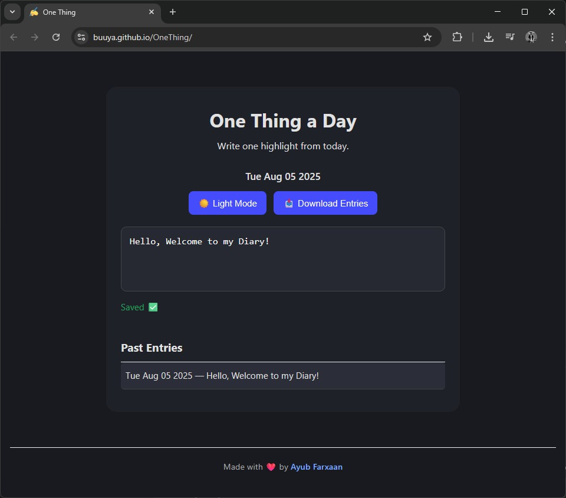

# One Thing a Day

> A minimalist daily logger — one thing, every day. No clutter, no distractions.



## 🔗 Live Demo
<a href="https://buuya.github.io/OneThing/" target="_blank" rel="noopener noreferrer">👉 View It on GitHub Pages</a>

---

## ✨ Why Use It?

In an age of information overload, **simplicity wins**.  
This app helps you focus on **just one meaningful thing** each day.

- ✅ Encourages mindfulness & daily habit
- ✅ Fully offline (no sign-ups or accounts)
- ✅ Elegant dark mode toggle
- ✅ Entries saved locally via `localStorage`
- ✅ Option to **download your log**

---

## 🛠️ Tech Stack

- HTML5  
- CSS3 (custom, minimal styling)  
- JavaScript (vanilla DOM manipulation)

---

## 📁 Folder Structure

```
OneThing/
├── index.html
├── assets/
│   ├── favicon.ico
│   ├── style.css
│   ├── script.js
│   └── homepage.jpg
└── README.md
```

## 🚀 Getting Started

### ✅ Use Online
Just open: <a href="https://buuya.github.io/OneThing" target="_blank" rel="noopener noreferrer">https://buuya.github.io/OneThing</a>

### 🧪 Run Locally

```bash
git clone https://github.com/buuya/OneThing.git
cd OneThing
open index.html   # or just double-click it
```

---

## 🤝 Contributing

Contributions, suggestions, and feature ideas are welcome!

```bash
🍴 Fork the repo
🛠️ Create a branch: git checkout -b feature-name
✨ Commit: git commit -m "Add cool feature"
📬 Push: git push origin feature-name
✅ Open a Pull Request
```

---

## 📜 License

This project is licensed under the **Buuya Studios Lab License**.  
Usage, distribution, and modifications must follow the terms outlined in [`LICENSE`](LICENSE).  
All rights reserved unless explicitly stated otherwise.

---

## 📏 Code of Conduct

Please read and follow the [Buuya Studios Lab Code of Conduct](CODE_OF_CONDUCT.md).  
We expect all contributors to maintain a respectful, inclusive, and welcoming environment.

---
## 🙌 Credits

Made with ❤️ by **Ayub Farxaan**  
<a href="https://buuya.github.io" target="_blank" rel="noopener noreferrer">🌐 My Portfolio</a>  
<a href="https://instagram.com/cptbuuya" target="_blank" rel="noopener noreferrer">📸 Instagram</a>  
<a href="https://linkedin.com/in/ayub-mox/" target="_blank" rel="noopener noreferrer">💼 Linkedin</a>  

<ul>
  <li>Icons by <a href="https://twemoji.twitter.com/" target="_blank" rel="noopener noreferrer">Twemoji</a></li>
  <li>Font: <a href="https://fonts.google.com/specimen/Inter" target="_blank" rel="noopener noreferrer">Inter</a></li>
  <li>Hosted via <a href="https://pages.github.com" target="_blank" rel="noopener noreferrer">GitHub Pages</a></li>
</ul>

---

> 💡 _"You can do anything, but not everything. One thing a day is a great start."_
